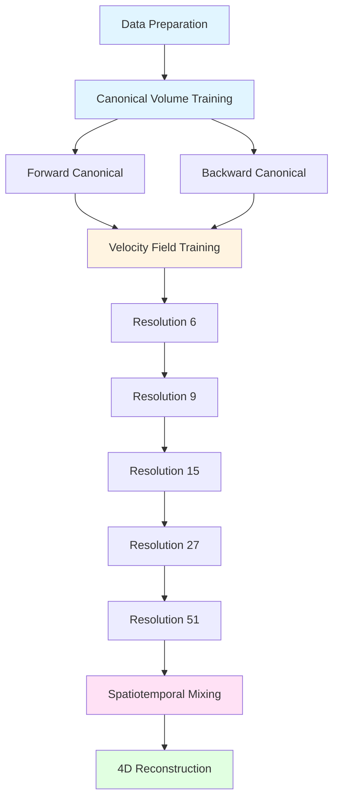

# High-speed X-ray tomography for 4D imaging

[](https://www.pnas.org/doi/10.1073/pnas.2521089122)
[](https://colab.research.google.com/github/igrega348/neural_xray/blob/main/colab/demo.ipynb)
[](https://doi.org/10.17863/CAM.126862)

## Table of Contents

- [What is this?](#what-is-this)
- [Key Features](#key-features)
- [Motivation](#motivation)
- [How it Works](#how-it-works)
- [Quick Start](#quick-start)
- [Prerequisites](#prerequisites)
- [Installation](#installation)
  - [Local Installation](#local-installation)
  - [Google Colab](#google-colab)
  - [Lambda Machines](#lambda-machines)
- [Usage](#usage)
  - [Synthetic Data Workflow](#synthetic-data-workflow)
  - [Experimental Data Workflow](#experimental-data-workflow)
  - [Workflow Overview](#workflow-overview)
- [Troubleshooting](#troubleshooting)
- [Citation](#citation)
- [License](#license)
- [References](#references)

## What is this?

This project provides a neural rendering framework for **high-speed 4D X-ray computed tomography (X-CT)**. Traditional X-CT requires collecting thousands of projections over an hour, making it impossible to capture fast-moving or deforming objects. Our method combines:

- **High-fidelity X-CT scans** at the start and end of deformation (static conditions)
- **A few simultaneous projections** taken during the deformation process
- **Neural rendering techniques** to reconstruct the full 3D spatio-temporal evolution

The result: you can now visualize and analyze dynamic deformations in 3D space over time, something that was previously impossible with conventional tomography.


_Left: Detailed brain X-CT [1]. Middle: X-CT of a gear with a set screw. Right: Strain inside a lattice sample._

## Key Features

- **4D Reconstruction**: Capture 3D volumes at multiple time points during dynamic deformation
- **Efficient Training**: Requires only a few projections during deformation, not thousands
- **High Fidelity**: Combines detailed static scans with sparse dynamic projections
- **Flexible Workflows**: Support for both synthetic data (quick testing) and experimental data (full pipeline)
- **Progressive Refinement**: Multi-resolution velocity field training for complex deformations
- **Easy to Use**: Pre-configured scripts for common workflows

## Motivation

X-ray computed tomography (X-CT) is an established method for 3D characterization of objects with applications ranging from medical imaging to industrial component inspection. While this project focuses on materials engineering, the developed techniques can be used in many other domains.

**The Problem**: Interrupted in-situ X-CT has been employed to study material response to deformation, revealing new insights into fracture behavior of lattice materials [2] or surprising behaviors in rubber elasticity [3]. However, the principle requires interrupting the deformation sequence at several stages to obtain a **tomogram** (3D volume reconstruction) at quasi-static conditions. 

The acquisition of a tomogram requires collecting many (~3000) projections and subsequent tomographic reconstruction. With exposure times on the order of 1 second in lab-based X-CT systems, tomogram acquisition takes about 1 hour—and this must be repeated at every deformation stage. Due to the number of projections needed for conventional tomographic reconstruction, it has not been possible to obtain 3D reconstruction of **dynamic, high-speed** deformations.

**Our Solution**: We address this limitation by developing a framework based on neural rendering that combines:
- High-fidelity X-CT obtained at the start and end of deformation
- Few simultaneous projections taken during deformation
- Neural networks to learn the deformation field and reconstruct the full 3D spatio-temporal evolution


_Illustration of the framework: combining static high-fidelity scans with sparse dynamic projections to reconstruct 4D deformation._

## How it Works

The framework follows a multi-stage training pipeline:



**Stage 1: Canonical Volume Training**
- Train neural radiance fields (NeRFs) to represent the 3D volume at the initial and final states
- Forward canonical: learns the volume at the start of deformation, $\mu_0$
- Backward canonical: learns the volume at the end of deformation, $\mu_1$

**Stage 2: Velocity Field Training**
- The canonical volumes are fixed and velocity field is trained that maps points from the initial and final state to intermediate states
- Uses progressively higher resolution control points (6→9→15→27→51) for complex deformations
- Iteratively alternates between using forward and backward velocity field integration

**Stage 3: Spatiotemporal Mixing**
- Fixes both canonical volumes and velocity fields, and learns a spatiotemporal mixing coefficient $\alpha(x,t)$
- Combines information from forward and backward velocity field integration (see PNAS paper for details)

**Stage 4: 4D Reconstruction**
- With a learned model, we can export 3D volumes at any time point during the deformation
- Visualize and analyze the full spatio-temporal evolution

## Quick Start

The easiest way to get started is to try our [Google Colab notebook](https://colab.research.google.com/github/igrega348/neural_xray/blob/main/colab/demo.ipynb), which provides a complete end-to-end demo of the framework. The notebook includes:

- Synthetic data generation
- Training of canonical volumes (forward and backward)
- Velocity field training
- Visualization with TensorBoard

**Note on Colab T4 GPU limitations:** The Colab notebook is configured to run on T4 GPUs with ~16GB memory. To fit within these constraints, training parameters have been reduced:
- Batch size: 2048 (canonical training), 256 (velocity field training)
- NeRF samples per ray: 256
- Training time: ~30 minutes on T4

The demo uses synthetic data, which is simpler than real experimental data. Real experimental data typically requires higher spatial resolution of the deformation field to capture more complex deformations. Large-scale runs with experimental data were performed on Grasshopper GH200 Lambda machines.

## Prerequisites

Before installing, ensure you have:

- **Python**: 3.9 or higher (3.9 recommended)
- **GPU**: NVIDIA GPU with CUDA support
  - CUDA 12.6.0 or compatible version
  - Minimum 16GB GPU memory for synthetic data
  - 32GB+ GPU memory recommended for experimental data
- **Operating System**: Linux, macOS, or Windows (Linux recommended for best performance)
- **Conda**: Miniconda or Anaconda for environment management
- **Git**: For cloning the repository with submodules

## Installation

### Local Installation

1. **Clone the repository with submodules:**
   ```bash
   git clone --recurse-submodules https://github.com/igrega348/neural_xray.git
   cd neural_xray
   ```

2. **Create and activate a conda environment:**
   ```bash
   conda create --name nerfstudio -y python=3.9
   conda activate nerfstudio
   pip install --upgrade pip
   ```

3. **Install CUDA toolkit:**
   ```bash
   conda install -c "nvidia/label/cuda-12.6.0" cuda-toolkit
   ```

4. **Install PyTorch with CUDA:**
   ```bash
   pip install torch==2.6.0 torchvision==0.21.0 torchaudio==2.6.0 --index-url https://download.pytorch.org/whl/cu126
   ```

5. **Install build dependencies:**
   ```bash
   pip install ninja
   pip install git+https://github.com/NVlabs/tiny-cuda-nn/#subdirectory=bindings/torch
   ```

6. **Install nerfstudio:**
   ```bash
   cd nerfstudio
   pip install --upgrade setuptools
   pip install -e .
   cd ..
   ```

7. **Install nerfstudio-xray:**
   ```bash
   cd nerfstudio-xray/nerf-xray/
   pip install -e .
   cd ../..
   ```

### Google Colab

The easiest way to get started is using our [Google Colab notebook](https://colab.research.google.com/github/igrega348/neural_xray/blob/main/colab/demo.ipynb). The notebook automatically installs all dependencies and provides a complete demo with synthetic data.

**Advantages:**
- No local setup required
- Free GPU access (T4 with 16GB)
- Pre-configured for quick testing
- ~30 minutes total training time

**Limitations:**
- Reduced batch sizes and resolution for T4 GPU constraints
- Suitable for synthetic data only
- Session timeouts may interrupt long training runs

### Lambda Machines

For large-scale experimental data training, we used Grasshopper GH200 Lambda machines. Setup instructions:

1. **Connect to Lambda machine:**
   - Using VS Code: Configure `.ssh/config` with identity file:
     ```
     Host 192.222.[XX].[XX]
       HostName 192.222.[XX].[XX]
       IdentityFile C:\Users\[John Smith]\.ssh\lambda-id
       User ubuntu
     ```
   - Or use SSH directly:
     ```bash
     ssh ubuntu@192.222.[XX].[XX] -i C:\Users\[John Smith]\.ssh\lambda-id
     ```

2. **Install Miniconda:**
   - Download platform-specific installer (e.g., for Arm-based cluster):
     ```bash
     wget https://repo.anaconda.com/miniconda/Miniconda3-latest-Linux-aarch64.sh
     sh Miniconda3-latest-Linux-aarch64.sh
     ```
   - Install to a persistent filesystem (e.g., `/home/ubuntu/nerfstudio-drive/miniconda3`)

3. **Set up environment:**
   ```bash
   conda create --name nerfstudio -y python=3.9
   conda activate nerfstudio
   pip install --upgrade pip
   conda install -c "nvidia/label/cuda-12.6.0" cuda-toolkit
   pip install torch==2.6.0 torchvision==0.21.0 torchaudio==2.6.0 --index-url https://download.pytorch.org/whl/cu126
   pip install ninja
   pip install git+https://github.com/NVlabs/tiny-cuda-nn/#subdirectory=bindings/torch
   cd neural_xray/nerfstudio
   pip install --upgrade setuptools
   pip install -e .
   cd ../nerfstudio-xray/nerf-xray/
   pip install -e .
   ```

## Usage

### Synthetic Data Workflow

For quick testing and learning, use the synthetic data workflow with [`scripts/demo_synthetic.sh`](scripts/demo_synthetic.sh):

```bash
bash scripts/demo_synthetic.sh
```

This script:
1. Generates synthetic data (if not already present)
2. Trains canonical volumes (forward and backward)
3. Trains velocity field at resolution 6, then refines to resolution 12
4. Saves outputs to `outputs/balls/`

**Expected outputs:**
- Canonical models: `outputs/balls/nerf_xray/canonical_F/` and `canonical_B/`
- Velocity field models: `outputs/balls/xray_vfield/vel_6/` and `vel_12/`
- Training logs and checkpoints in respective directories

**Training time:** ~30 minutes on T4 GPU, ~15 minutes on A100 GPU

**Visualization:**
- TensorBoard logs are saved in each output directory
- View with: `tensorboard --logdir outputs/balls/`

### Experimental Data Workflow

For experimental datasets, use the full training pipeline with [`scripts/submit.sh`](scripts/submit.sh):

```bash
bash scripts/submit.sh data/experimental/your_dataset
```

This script runs a complete pipeline:
1. Canonical volume training (forward and backward)
2. Velocity field training with progressive resolution refinement:
   - Resolution 6 (3000 steps)
   - Resolution 9 (3000 steps)
   - Resolution 15 (3000 steps)
   - Resolution 27 (3000 steps)
   - Resolution 51 (3000 steps)
3. Spatiotemporal mixing (3000 steps)

**Total training:** ~18,000 steps, requires high-memory GPU (32GB+ recommended)

**Experimental datasets:**
- Download from: https://doi.org/10.17863/CAM.126862
- Place in `data/experimental/` directory
- Suggested to start with `04_kel_base_comp`
- If you use your own data, ensure it follows the expected structure (see dataset documentation)

**Data structure requirements:**
- `transforms_00.json` - Initial state projections
- `transforms_XX.json` - Final state projections
- `transforms_00_to_XX.json` - Dynamic projections during deformation
- `*.yaml` or `*.npz` - Volume grid files for initial and final states

### Workflow Overview

The complete training pipeline consists of:

1. **Data Preparation**
   - Organize X-ray projections, transforms JSON files and volume grid files (YAML or NPZ format)
   - Optionally downscale images for faster training

2. **Canonical Volume Training**
   - Train forward canonical: learns 3D volume at initial state
   - Train backward canonical: learns 3D volume at final state
   - Each takes ~3000 training steps and a few minutes

3. **Velocity Field Training**
   - Combines forward and backward canonical volumes
   - Learns deformation field mapping initial to final state
   - Progressive refinement: start at low resolution (6 control points), refine to high resolution (51 control points)
   - Each resolution stage: ~3000 training steps
   - Matrix method is faster but typically only affordable for resolution up to $n=15$ due to memory requirements. The neighborhood method has to be used for higher $n$.

4. **Spatiotemporal Mixing** (experimental data only)
   - Refines deformation field using temporal information
   - Enables smooth interpolation between time points
   - ~3000 training steps

5. **Visualization and Analysis**
   - Use TensorBoard to monitor training progress
   - Export 3D volumes at specific time points
   - Analyze deformation patterns and compare with ground truth where available. When ground truth is not available, check the self-correlation metric (see the PNAS paper)

## Troubleshooting

### Common Installation Issues

**CUDA version mismatch:**
- Ensure CUDA toolkit version matches PyTorch CUDA version
- Check with: `nvcc --version` and `python -c "import torch; print(torch.version.cuda)"`

**tiny-cuda-nn build failures:**
- Ensure `ninja` is installed: `pip install ninja`
- Try reinstalling: `pip uninstall tinycudann && pip install git+https://github.com/NVlabs/tiny-cuda-nn/#subdirectory=bindings/torch`

**Out of memory errors:**
- Reduce batch size in training scripts
- Use lower resolution or downscale images
- Close other GPU processes

### Training Issues

**Optimizer loading error:**
```
KeyError: 'optimizers'
```
This typically occurs when velocity field training fails and you try to restart. Delete the velocity field output directory before restarting:
```bash
rm -r outputs/[dataset]/xray_vfield/vel_[resolution]/
```

**Slow training:**
- Check GPU utilization: `nvidia-smi`
- Ensure CUDA is being used: check logs for "CUDA" device
- Consider using mixed precision training (if supported)

**Poor reconstruction quality:**
- Increase training steps
- Use higher resolution velocity field
- Check data quality and projection alignment
- Ensure sufficient projections at initial and final states

### Colab-Specific Issues

See the [Colab notebook](https://colab.research.google.com/github/igrega348/neural_xray/blob/main/colab/demo.ipynb) for Colab-specific troubleshooting tips and common errors.

## Citation

If you use this code in your research, please cite:

```bibtex
@article{grega2024highspeed,
  title={High-speed X-ray tomography for 4D imaging},
  author={Ivan Grega  and William Whitney  and Vikram Sudhir Deshpande },
  journal={Proceedings of the National Academy of Sciences},
  year={2025},
  doi={10.1073/pnas.2521089122},
  url={https://www.pnas.org/doi/abs/10.1073/pnas.2521089122}
}
```

**Paper link:** https://www.pnas.org/doi/10.1073/pnas.2521089122

## License

This project is licensed under the MIT License - see the [LICENSE](LICENSE) file for details.

## References

[1] Brain CT animation adapted from Human Organ Atlas ([doi:10.15151/ESRF-DC-572252655](http://doi.org/10.15151/ESRF-DC-572252655), [https://human-organ-atlas.esrf.eu/datasets/572252538](https://human-organ-atlas.esrf.eu/datasets/572252538)) under CC-BY-4.0 license.

[2] Shaikeea, A.J.D., Cui, H., O'Masta, M. et al. The toughness of mechanical metamaterials. Nat. Mater. 21, 297–304 (2022). [doi.org/10.1038/s41563-021-01182-1](https://doi.org/10.1038/s41563-021-01182-1).

[3] Wang, Z., Das, S., Joshi, A. et al. 3D observations provide striking findings in rubber elasticity. PNAS, 121, 24 (2024). [doi.org/10.1073/pnas.2404205121](https://doi.org/10.1073/pnas.2404205121)
